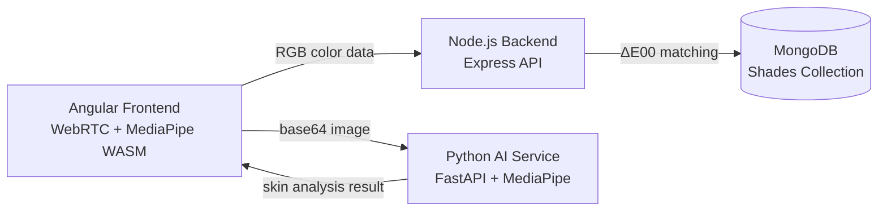
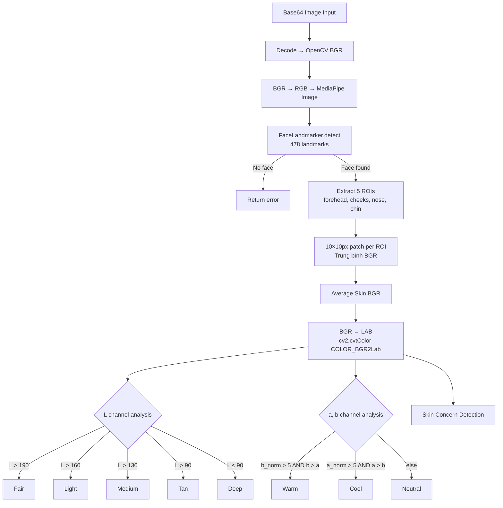

# TirTir Project — Virtual Camera & AI Service: Dữ Liệu Cho Báo Cáo

---

## 2.2. Artificial Intelligence and Machine Learning in E-Commerce

### 2.2.1. Machine Learning for Personalized Product Recommendations

**Chatbot NLP Engine** — [chatbot_engine.py](file:///d:/TirTir-Project/ai-service/chatbot_engine.py)

| Thành phần | Chi tiết kỹ thuật |
|---|---|
| **Model** | `MultinomialNB` (Naive Bayes) pipeline với `CountVectorizer(ngram_range=(1,2))` |
| **Framework** | scikit-learn ≥ 1.4.0 |
| **Training data** | 32 mẫu câu tiếng Việt × 7 intent classes |
| **Intent classes** | `consultation`, `price`, `greeting`, `info`, `shipping`, [return](file:///d:/TirTir-Project/ai-service/test_skin_analyzer.py#84-89) |
| **Product DB** | [chatbot_products.csv](file:///d:/TirTir-Project/ai-service/chatbot_products.csv) (30KB, ~50+ sản phẩm TirTir) |
| **Scoring** | Keyword-based scoring map (14 keywords) → match sản phẩm theo `Skin_Type_Target`, `Main_Concern`, `Category`, `Name` |

**Quy trình hoạt động:**
1. User gửi message tiếng Việt → NLP model classify intent
2. Nếu intent = `consultation` hoặc `price` → [_smart_recommend()](file:///d:/TirTir-Project/ai-service/chatbot_engine.py#87-107) keyword scoring
3. Mỗi keyword match: `+10 điểm` cho field chính, `+2 điểm` cho `Description_Short`
4. Sản phẩm có điểm cao nhất → trả về `Product_ID`, `Name`, `Price`, [Image](file:///d:/TirTir-Project/frontend/tirtir-frontend/src/app/features/shade-finder/shade-finder.ts#206-212), `Slug`

**Shade Matching Algorithm** — [shade.controller.js](file:///d:/TirTir-Project/backend/controllers/shade.controller.js) + [colorUtils.js](file:///d:/TirTir-Project/backend/utils/colorUtils.js)

| Thành phần | Chi tiết |
|---|---|
| **Color distance** | CIEDE2000 (ΔE00) — industry standard cho perceptual color difference |
| **Weighted scoring** | `totalScore = ΔE00 + pUndertone + pBrightness` |
| **Undertone penalty** | Mismatch (Warm↔Cool) = +5 pts, Neutral↔other = +2 pts |
| **Brightness penalty** | Shade tối hơn user = `+(L_user - L_shade) × 2` pts |
| **Oxidation simulation** | Da dầu (Oily) → `targetL += 2.5` (chọn sáng hơn 1 tone) |
| **Output** | Top 5 shade matches with matchScore, deltaE, predictedUndertone |

---

### 2.2.2. Computer Vision for Virtual Try-On Experiences

**Kiến trúc 3-tier:**



**Frontend — Face Tracker** — [face-tracker.service.ts](file:///d:/TirTir-Project/frontend/tirtir-frontend/src/app/core/services/face-tracker.service.ts)

| Thành phần | Chi tiết |
|---|---|
| **Library** | `@mediapipe/tasks-vision` (WASM, GPU-accelerated) |
| **Model** | [face_landmarker.task](file:///d:/TirTir-Project/ai-service/face_landmarker.task) (float16, ~3.6MB) từ Google CDN |
| **Running mode** | `VIDEO` — real-time frame-by-frame detection |
| **Landmarks** | 478-point face mesh → extract 5 ROI points |
| **Pose validation** | Yaw check (nose vs cheek midpoint, ≤5% deviation) + Eye blink detection |
| **Output signals** | `isFaceDetected: Signal<boolean>`, `facePoints: Signal<FacePoints>` |

**5 ROI Points được track:**
- `forehead` (landmark #151)
- `nose` (landmark #1)
- `leftCheek` (landmark #117)
- `rightCheek` (landmark #346)
- `chin` (landmark #199)

**Frontend — Shade Finder Component** — [shade-finder.ts](file:///d:/TirTir-Project/frontend/tirtir-frontend/src/app/features/shade-finder/shade-finder.ts)

| Feature | Implementation |
|---|---|
| **Camera** | `navigator.mediaDevices.getUserMedia()` — 640×480, front-facing |
| **Real-time detection loop** | `requestAnimationFrame()` → [detectFace()](file:///d:/TirTir-Project/frontend/tirtir-frontend/src/app/core/services/face-tracker.service.ts#37-88) mỗi frame |
| **Color extraction** | Canvas `getImageData()` lấy 10×10px patch tại mỗi ROI point |
| **Smoothing** | Rolling average 15 frames (`HISTORY_SIZE = 15`) |
| **Lighting validation** | Luminance check (`> 30`), LAB range check (`L > 25`, `a ∈ [5,45]`, `b ∈ [5,55]`) |
| **RGB→LAB conversion** | CIE sRGB → XYZ (D65 illuminant) → LAB, implement trực tiếp trong TypeScript |
| **UI feedback** | SVG oval face guide, green/yellow/red lighting status, scan-dot animation |

---

## 3.3. Phase 2 - Enhancement 1: Objective AI Skin Analysis Module

### 3.3.1. As-Is vs. To-Be Workflow Analysis

| | As-Is (Subjective AR — Shade Finder) | To-Be (Objective AI — Skin Analysis) |
|---|---|---|
| **Input** | Camera RGB pixel colors tại 5 ROI | Full-resolution face image (base64) |
| **Processing** | Frontend-only: trung bình RGB → RGB→LAB → validate | Backend AI: MediaPipe Face Mesh → 5 ROI polygon extraction → OpenCV LAB analysis |
| **Face detection** | MediaPipe WASM in browser (GPU) | MediaPipe FaceLandmarker in Python server (CPU) |
| **Color analysis** | Chỉ lấy 1 pixel 10×10 mỗi ROI | Polygon mask cho từng ROI vùng, trung bình toàn vùng |
| **Output** | 1 shade recommendation dựa trên ΔE00 | skinTone, undertone, skinType, concerns[], confidence |
| **Skin concerns** | ❌ Không detect | ✅ Acne, Redness, Dark Circles, Pores, Oily Skin |
| **Objectivity** | Subjective (phụ thuộc ánh sáng) | Objective (phân tích LAB channels, variance, specular highlights) |

### 3.3.2. Processing Pipeline: MediaPipe Integration & LAB Color Conversion

**AI Service Pipeline** — [skin_analyzer.py](file:///d:/TirTir-Project/ai-service/skin_analyzer.py)



**5 ROI Landmark Groups** (MediaPipe 478-point model):

| ROI | Landmark indices | Mục đích |
|---|---|---|
| `forehead` | [10, 109, 338, 9] | Skin tone + Oily detection |
| `left_cheek` | [116, 117, 118, 100] | Acne/Redness analysis |
| `right_cheek` | [345, 346, 347, 329] | Acne/Redness analysis |
| `nose` | [4, 1, 2, 5] | Skin tone baseline |
| `chin` | [152, 175, 171, 148] | Skin tone verification |

**Skin Concern Detection Algorithms:**

| Concern | Method | Threshold |
|---|---|---|
| **Acne/Blemishes** | `std(a_channel)` trên vùng cheeks (polygon mask) | `> 10` |
| **Sensitive/Redness** | `mean(a_channel)` trên vùng cheeks | `> 145` |
| **Dark Circles** | `mean_cheek_L - mean_eye_L` (brightness delta) | `> 15` |
| **Visible Pores** | `Laplacian(cheeks_gray).var()` (texture variance) | `> 1500` |
| **Oily Skin** | `count(V_channel > 200) / total` trên forehead (specular highlights) | `> 10%` |

**LAB Color Space — Tại sao chọn LAB thay vì RGB?**
- **L (Lightness)**: 0–255, dùng xác định skin tone (Fair → Deep)
- **a (Green↔Red)**: `a - 128` = normalized, chỉ số redness/sensitivity
- **b (Blue↔Yellow)**: `b - 128` = normalized, cùng với `a` xác định undertone
- LAB **perceptually uniform** — ΔE trong LAB tương ứng với sự khác biệt mà mắt người cảm nhận, khác với RGB

**Technology Stack:**

| Component | Technology | Version |
|---|---|---|
| API Framework | FastAPI | 0.115.6 |
| ASGI Server | Uvicorn | 0.34.0 |
| Face Detection | MediaPipe | 0.10.18 |
| Image Processing | OpenCV (headless) | 4.10.0.84 |
| Math/Array | NumPy | ≥ 1.26.4 |
| Rate Limiting | SlowAPI | ≥ 0.1.9 |
| Container | Docker (python:3.11-slim) | — |
| Auth | API Key via `X-API-Key` header | — |
| Rate Limit | `/analyze`: 10 req/min, `/chat`: 30 req/min | — |

---

## 4.2. AI Skin Analysis Module Results

### 4.2.1. Skin Analysis Interface & Camera Interaction

**API Endpoints:**

```
POST /analyze   → Skin analysis (base64 image → skinTone, undertone, concerns)
POST /chat      → Chatbot NLP (Vietnamese text → product recommendation)
GET  /health    → Health check (model status, auth status)
```

**Request/Response Models:**

```json
// POST /analyze — Request
{
  "image_base64": "data:image/jpeg;base64,/9j/4AAQ..."
}

// POST /analyze — Response (success)
{
  "success": true,
  "data": {
    "skinTone": "Medium",
    "undertone": "Warm",
    "skinType": "Normal",
    "concerns": ["Dark Circles", "Visible Pores"],
    "confidence": 0.95,
    "debug_values": { "L": 145.2, "a": 133.8, "b": 139.5 }
  },
  "processing_time_ms": 187.34
}
```

**UI Elements mô tả (cho screenshots):**

1. **Camera View** — Video stream 640×480 với SVG overlay:
   - Oval face guide (ellipse `cx=320, cy=230, rx=155, ry=190`)
   - 5 green scan dots tại ROI points (forehead, nose, cheeks, chin)
   - Animated pulsing border (green = ready, yellow = adjusting, red = error)
   - Dark mask bao quanh oval (rgba overlay)

2. **Lighting Status Chip** — Bottom-center overlay:
   - ✅ Success: "Ánh sáng tốt — Sẵn sàng quét!" (green background)
   - ⚠️ Warning: "Không tìm thấy khuôn mặt" / "Đang khởi động camera..." (yellow)
   - ❌ Error: "Ánh sáng quá yếu" / "Màu da bị ám" (red)

3. **Controls Panel:**
   - Skin type selector: Thường / Dầu / Khô (pill buttons)
   - "✨ Quét Shade" button (gradient: #FF3CAC → #784BA0 → #2B86C5)
   - Tip box: "Nhìn thẳng vào camera, đảm bảo ánh sáng tự nhiên..."

4. **Result Modal** (sau khi quét):
   - 🏆 Best Match hero card: product image, shade swatch + hex code, match bar (%), undertone/coverage/finish chips
   - Other matches list: compact cards với match %, "Thêm" button
   - Add-to-cart integration trực tiếp từ modal

5. **Scanning Overlay** (trong lúc xử lý):
   - Semi-transparent dark overlay
   - Animated scan line (gradient pink, `scanDown` animation)
   - "Đang phân tích tông da..." text

**Validation Gates (trước khi cho phép quét):**
1. Camera active + face detected
2. Eyes open (blendshape score < 0.5)
3. Head straight (yaw deviation < 5%)
4. Lighting validation pass (luminance > 30, LAB ranges)
5. Minimum 5 frames of stable color history

**Testing:**
- Unit tests: [test_skin_analyzer.py](file:///d:/TirTir-Project/ai-service/test_skin_analyzer.py) (4 test classes, 8 test cases)
- Covers: base64 decode, model init, no-face handling, face analysis output structure
- Run command: `python -m pytest test_skin_analyzer.py -v`
